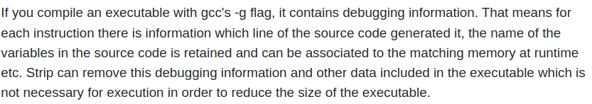

# Flag
This is an interesting challenge. It will get us started with ```Reverse Engineering```.

## gdb?

When loading the file with gdb and checking it, I found gdb gave a weird response.

```
(gdb) disassemble main
No symbol table is loaded.  Use the "file" command.
```

Lets check if everything is correct with the file.

## Checking the Executable

Lets see details of the executable using ```file``` command.

```
➜  Flag git:(main) file flag  
flag: ELF 64-bit LSB executable, x86-64, version 1 (GNU/Linux), statically linked, stripped
```

It says ```stripped```. Lets check out what is this.Got this answer on stack overflow.



Hmm interesting, that is the reason we were not able to debug it with GDB.Lets try to find out if there is a way to un-strip the stripped file.

# Packed

The first thing to know is that not ALL the data/code in a packed executable is compressed. Some of it, namely the unpacking routine, remains unchanged. There are many public packers available on the internet, and most of them leave a very recognizable signature in the unpacking routine. This makes it trivial to determine what packer was used to pack the code.

Lets check if pur file is packed.

```
➜  Flag git:(main) strings flag | grep packed
$Info: This file is packed with the UPX executable packer http://upx.sf.net $
```

```UPX``` is an open source executable packer, so we can assume the binary is packed using it. I went ahead and downloaded the program.

```
sudo apt-get install upx
```
```
➜  Flag git:(main) ✗ upx -d flag 
                       Ultimate Packer for eXecutables
                          Copyright (C) 1996 - 2017
UPX 3.94        Markus Oberhumer, Laszlo Molnar & John Reiser   May 12th 2017

        File size         Ratio      Format      Name
   --------------------   ------   -----------   -----------
    883745 <-    335288   37.94%   linux/amd64   flag

Unpacked 1 file.

```

Now lets again analyze the unpacked file with gdb.

## GDB

Disassemble the main function

```
(gdb) disassemble main
Dump of assembler code for function main:
   0x0000000000401164 <+0>:	push   rbp
   0x0000000000401165 <+1>:	mov    rbp,rsp
   0x0000000000401168 <+4>:	sub    rsp,0x10
   0x000000000040116c <+8>:	mov    edi,0x496658
   0x0000000000401171 <+13>:	call   0x402080 <puts>
   0x0000000000401176 <+18>:	mov    edi,0x64
   0x000000000040117b <+23>:	call   0x4099d0 <malloc>
   0x0000000000401180 <+28>:	mov    QWORD PTR [rbp-0x8],rax
   0x0000000000401184 <+32>:	mov    rdx,QWORD PTR [rip+0x2c0ee5]        # 0x6c2070 <flag>
=> 0x000000000040118b <+39>:	mov    rax,QWORD PTR [rbp-0x8]
   0x000000000040118f <+43>:	mov    rsi,rdx
   0x0000000000401192 <+46>:	mov    rdi,rax
   0x0000000000401195 <+49>:	call   0x400320
   0x000000000040119a <+54>:	mov    eax,0x0
   0x000000000040119f <+59>:	leave  
   0x00000000004011a0 <+60>:	ret    

```

Our flag is stored in the ```rdx``` register. So make a breakpoint at ```0x000000000040118b``` address and then we will read the content of rdx.

```
(gdb) x/ls $rdx
0x496628:	"UPX...? sounds like a delivery service :)"
```

Got the flag :)